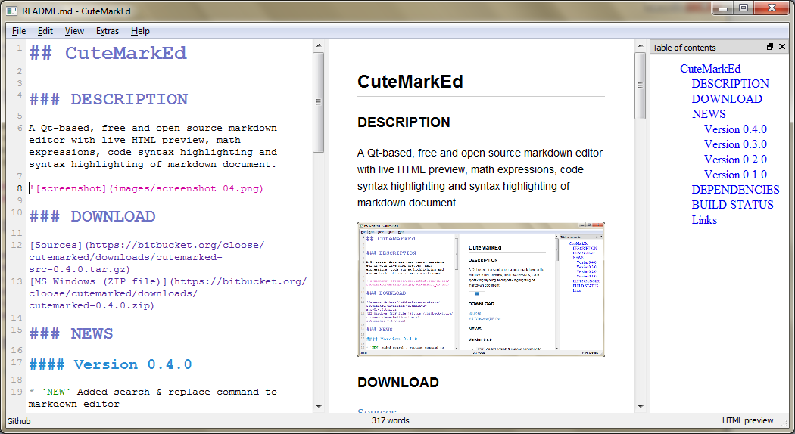

## CuteMarkEd

### DESCRIPTION

A Qt-based, free and open source markdown editor with live HTML preview, math expressions, code syntax highlighting and syntax highlighting of markdown document.

  <h4 style="border-bottom: 1px solid">Multiple styles</h4>
  

    

      
    

    

      
View and export the generated HTML in multiple included styles.

    

  

  <h4 style="border-bottom: 1px solid">Live HTML Preview</h4>
  

    

      
    

    

      
Instantly updated preview of how the Markdown document looks like in HTML.

    

  

  <h4 style="border-bottom: 1px solid">HTML and PDF Export</h4>
  

    

      
    

    

      
Export the document as HTML or PDF file.

    

  

  <h4 style="border-bottom: 1px solid">Document statistics</h4>
  

    

      
    

    

      
See your word count as you work.

    

  

  <h4 style="border-bottom: 1px solid">Code Syntax Highlighting</h4>
  

    

      
    

    

      
Support for highlighting syntax in code blocks.

      
Rendering in the HTML preview is provided by JavaScript library Highlight.js.

    

  

  <h4 style="border-bottom: 1px solid">Math Support</h4>
  

    

      
    

    

      
Support for LaTeX or MathML expressions in the Markdown document.

      
Rendering in the HTML preview is provided by JavaScript library MathJax.

    

  

### DOWNLOAD

[Sources](https://github.com/cloose/CuteMarkEd/archive/v0.4.1.tar.gz)  
[MS Windows (ZIP file)](http://dl.bintray.com/cloose/CuteMarkEd/cutemarked-0.4.1.zip?direct)  
[OpenSUSE 12.3 (RPM)](https://build.opensuse.org/project/show?project=home%3Acloose1974)

### NEWS

#### Version 0.4.1

New Features:

* `NEW` Added Czech translation created by Pavel Fric

#### Version 0.4.0

New Features:

* `NEW` Added search & replace command to markdown editor
* `NEW` New CSS styles 'Clearness' and 'Clearness Dark'
* `NEW` Document statistics with line, word and character count
* `NEW` 'Center Paragraph' formatting command

Improvements:

* `IMPROVED` 'Export to PDF' function with selection of paper size and orientation
* `IMPROVED` Handling of links to local resource in HTML preview

Fixes:

* `FIX` Use fixed-pitch font for markdown editor on MS Windows
* `FIX` Missing character in HTML preview when markdown document did not end with a line break
* `FIX` `<style>` elements are not parsed anymore but included in the generated HTML

#### Version 0.3.0

New Features:

* `NEW`  Print HTML function 
* `NEW`  Added several new functions for text formatting (strong, emphasize, strikethrough and inline code)
* `NEW`  Use [Kevin Burke's Markdown.css](http://kevinburke.bitbucket.org/markdowncss/) as default style for the live preview
* `NEW`  Synchronize scrollbars of markdown editor and live preview  
* `NEW` Support for displaying math expressions in HTML using [MathJax](http://www.mathjax.org/)
* `NEW` Support for code syntax highlighting using [Highlight.js](http://softwaremaniacs.org/soft/highlight/en/)
* `NEW` Support for non-latin languages

Improvements:

* `IMPROVED` Add icons to main menu

Fixes:

* `FIX`  Blocking UI when inserting big text using copy&paste

#### Version 0.2.0

New Features:

* `NEW`  Add table of contents view with jump to header function  
* `NEW`  New default theme for syntax highlighting of the markdown document
* `NEW`  German translation  
* `NEW`  Copy HTML source to clipboard function added to edit menu  

Fixes:

* `FIX`  Behavior of splitter during window resize

#### Version 0.1.0

First release with basic functionality working. 

### DEPENDENCIES

* Qt 5.x (LGPL v2.1)
* [Discount 2.1.6](http://www.pell.portland.or.us/~orc/Code/discount/) (3-clause BSD)
* [PEG Markdown Highlight](http://hasseg.org/peg-markdown-highlight/) (MIT License)

### BUILD STATUS

### LINKS

[http://www.ohloh.net/p/CuteMarkEd](http://www.ohloh.net/p/CuteMarkEd)  
[http://freecode.com/projects/cutemarked](http://freecode.com/projects/cutemarked)  
[http://qt-apps.org/content/show.php/CuteMarkEd?content=158801](http://qt-apps.org/content/show.php/CuteMarkEd?content=158801)
